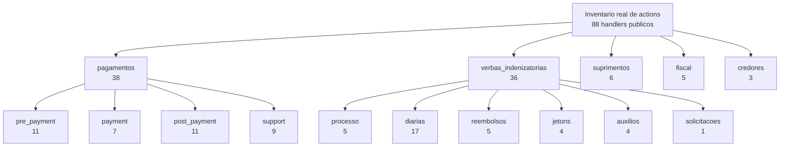

# Inventário de Actions

Este conjunto de páginas existe para responder a uma pergunta operacional simples: quais ações transacionais o usuário consegue disparar no sistema e quais workers, helpers e services entram em cena quando isso acontece.

O foco aqui não é contrato HTTP completo. Para rota, permissão, payload e feedback detalhado, continue usando [Dicionários Operacionais](dicionarios_operacionais.md). Este inventário serve como mapa mental do sistema: action → worker/helper/service → efeito.

## Escopo usado nesta contagem

- entram somente funções públicas definidas em arquivos `actions.py`
- entram actions HTML e JSON quando são handlers transacionais reais
- entram submódulos de suporte, importação, sincronização e cancelamento quando ficam em `actions.py`
- ficam fora helpers privados com prefixo `_`
- ficam fora `panels.py`, `apis.py` e views `GET`

## Total atual no código

| Domínio | Arquivos `actions.py` | Actions públicas |
|---|---:|---:|
| `pagamentos` | 13 | 38 |
| `verbas_indenizatorias` | 8 | 36 |
| `suprimentos` | 2 | 6 |
| `fiscal` | 2 | 5 |
| `credores` | 1 | 3 |
| **Total** | **26** | **88** |

## Como a seção foi fatiada

O volume é alto demais para uma página única continuar legível. Por isso a documentação foi quebrada em partes por namespace funcional:

1. [Pagamentos / Pré-pagamento](inventario_actions_pagamentos_pre_payment.md)
2. [Pagamentos / Payment](inventario_actions_pagamentos_payment.md)
3. [Pagamentos / Pós-pagamento](inventario_actions_pagamentos_post_payment.md)
4. [Pagamentos / Support](inventario_actions_pagamentos_support.md)
5. [Verbas / Processo e Diárias](inventario_actions_verbas_processo_diarias.md)
6. [Verbas / Demais trilhas](inventario_actions_verbas_demais.md)
7. [Fiscal, Suprimentos e Credores](inventario_actions_fiscal_suprimentos_credores.md)

## Leituras úteis a partir deste inventário

- quando quiser entender o hub e a spoke de uma etapa, comece pela action da spoke e siga o diagrama
- quando quiser saber se uma regra vive na view ou foi empurrada para worker, compare este inventário com [Padrão Manager-Worker](../arquitetura/manager_worker.md)
- quando quiser o contrato fino de uma action específica, complemente com [Dicionários Operacionais](dicionarios_operacionais.md)

## Achados rápidos

- O maior volume está praticamente empatado entre `pagamentos` e `verbas_indenizatorias`.
- Há mais actions no código do que as hoje cobertas pelo catálogo operacional existente.
- O projeto já está bastante orientado a worker/service, mas ainda existem actions com mutação inline, principalmente em rotinas de reunião, seleção em sessão e toggles simples.