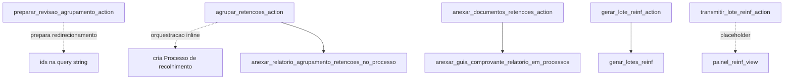
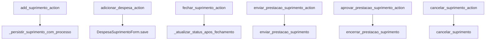
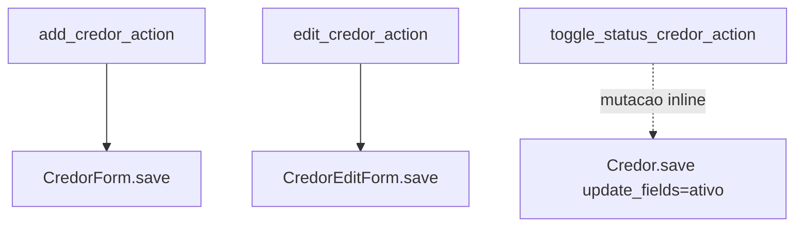

# Inventário de Actions — Fiscal, Suprimentos e Credores

Este recorte junta três domínios menores em volume, mas importantes para compreender as bordas do sistema: fiscal, suprimentos e cadastro de credores.

## Visão do recorte

| Domínio | Actions |
|---|---:|
| `fiscal` | 5 |
| `suprimentos` | 6 |
| `credores` | 3 |
| **Total** | **14** |

## Domínio `fiscal`

| Action | Worker/helper/service acionado | Efeito principal |
|---|---|---|
| `preparar_revisao_agrupamento_action` | redirecionamento com seleção de IDs | monta a etapa de revisão antes do agrupamento |
| `agrupar_retencoes_action` | orquestração inline + `anexar_relatorio_agrupamento_retencoes_no_processo` | cria processo de recolhimento e vincula retenções |
| `anexar_documentos_retencoes_action` | `anexar_guia_comprovante_relatorio_em_processos` | anexa guia, comprovante e relatório mensal |
| `gerar_lote_reinf_action` | `gerar_lotes_reinf` | gera os lotes EFD-Reinf em arquivo |
| `transmitir_lote_reinf_action` | placeholder | hoje apenas devolve feedback de indisponibilidade |

## Domínio `suprimentos`

| Action | Worker/helper/service acionado | Efeito principal |
|---|---|---|
| `add_suprimento_action` | `_persistir_suprimento_com_processo` | cria suprimento e processo financeiro associado |
| `adicionar_despesa_action` | `DespesaSuprimentoForm.save()` | registra despesa da prestação |
| `fechar_suprimento_action` | `_atualizar_status_apos_fechamento` | fecha a prestação por trilha direta |
| `enviar_prestacao_suprimento_action` | `enviar_prestacao_suprimento` | envia a prestação para revisão |
| `aprovar_prestacao_suprimento_action` | `encerrar_prestacao_suprimento` | aprova e encerra a prestação |
| `cancelar_suprimento_action` | `cancelar_suprimento` | cancela o suprimento com devolução quando aplicável |

## Domínio `credores`

| Action | Worker/helper/service acionado | Efeito principal |
|---|---|---|
| `add_credor_action` | `CredorForm.save()` | cria credor |
| `edit_credor_action` | `CredorEditForm.save()` | atualiza dados cadastrais do credor |
| `toggle_status_credor_action` | mutação inline em `Credor.save(update_fields=["ativo"])` | bloqueia ou reativa o credor |

## Leitura prática

- `fiscal` já separa bem o worker pesado de anexação mensal e o gerador Reinf, mas ainda mantém o agrupamento principal dentro da própria action.
- `suprimentos` está razoavelmente desacoplado: quase toda mutação relevante já vai para worker ou service nominal.
- `credores` continua simples e form-driven, o que faz sentido pelo perfil de CRUD operacional.