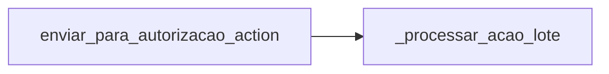
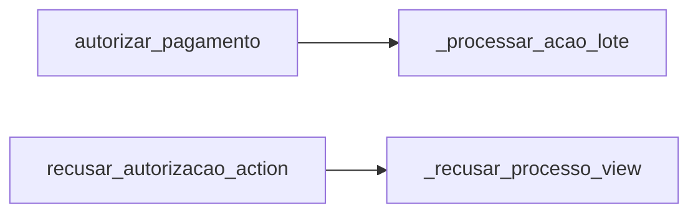
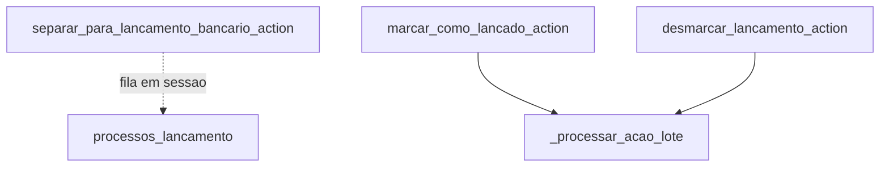
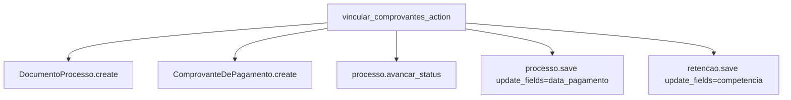

# Inventário de Actions — Pagamentos / Payment

Este recorte cobre a esteira financeira estrita: contas a pagar, autorização, lançamento bancário e registro de comprovantes.

## Visão do recorte

| Namespace | Actions |
|---|---:|
| `payment/contas_a_pagar` | 1 |
| `payment/autorizacao` | 2 |
| `payment/lancamento` | 3 |
| `payment/comprovantes` | 1 |
| **Total** | **7** |

## Namespace `payment/contas_a_pagar`

| Action | Worker/helper/service acionado | Efeito principal |
|---|---|---|
| `enviar_para_autorizacao_action` | `_processar_acao_lote` | move processos elegíveis para a fila de autorização |

## Namespace `payment/autorizacao`

| Action | Worker/helper/service acionado | Efeito principal |
|---|---|---|
| `autorizar_pagamento` | `_processar_acao_lote` | autoriza pagamentos em lote |
| `recusar_autorizacao_action` | `_recusar_processo_view` | recusa um processo e devolve a etapa com pendência formal |

## Namespace `payment/lancamento`

| Action | Worker/helper/service acionado | Efeito principal |
|---|---|---|
| `separar_para_lancamento_bancario_action` | manipulação de sessão | guarda a seleção de processos para o painel de lançamento |
| `marcar_como_lancado_action` | `_processar_acao_lote` | avança lote para lançado aguardando comprovante |
| `desmarcar_lancamento_action` | `_processar_acao_lote` | reverte o lote de lançamento |

## Namespace `payment/comprovantes`

| Action | Worker/helper/service acionado | Efeito principal |
|---|---|---|
| `vincular_comprovantes_action` | criação inline de `DocumentoProcesso` e `ComprovanteDePagamento` + `processo.avancar_status(...)` | anexa comprovantes, atualiza data de pagamento e leva o processo a `PAGO - EM CONFERÊNCIA` |

## Leitura prática

- O núcleo das transições em lote aqui é `_processar_acao_lote`.
- O ponto em que o pagamento “materializa” evidência documental é `vincular_comprovantes_action`.
- O lançamento bancário propriamente dito mistura um passo de sessão (`separar`) e dois passos de transição efetiva (`marcar` e `desmarcar`).