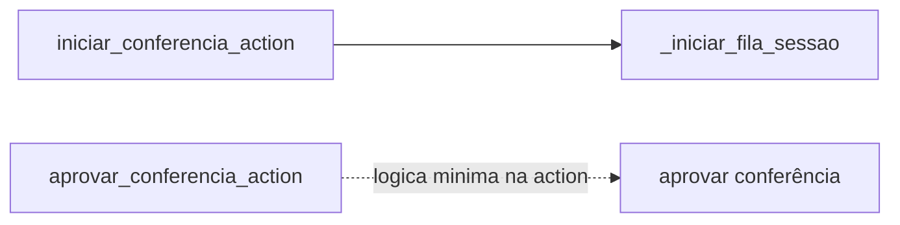
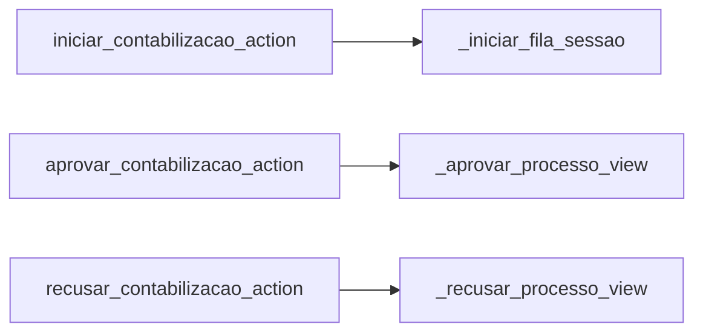
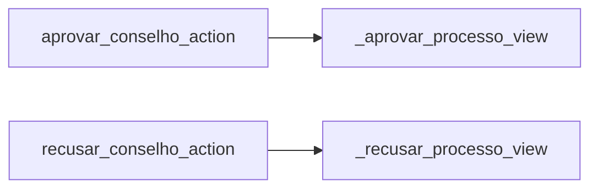
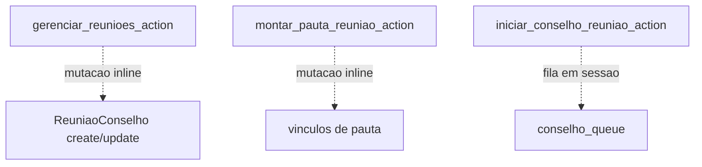
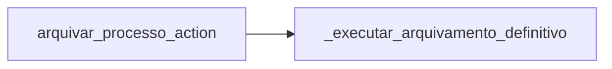

# Inventário de Actions — Pagamentos / Pós-pagamento

Este recorte cobre conferência, contabilização, conselho e arquivamento definitivo.

## Visão do recorte

| Namespace | Actions |
|---|---:|
| `post_payment/conferencia` | 2 |
| `post_payment/contabilizacao` | 3 |
| `post_payment/conselho` | 2 |
| `post_payment/reunioes` | 3 |
| `post_payment/arquivamento` | 1 |
| **Total** | **11** |

## Namespace `post_payment/conferencia`

| Action | Worker/helper/service acionado | Efeito principal |
|---|---|---|
| `iniciar_conferencia_action` | `_iniciar_fila_sessao` | cria a fila de revisão em sessão |
| `aprovar_conferencia_action` | lógica mínima na action | aprova a revisão da conferência e segue a fila da etapa |

## Namespace `post_payment/contabilizacao`

| Action | Worker/helper/service acionado | Efeito principal |
|---|---|---|
| `iniciar_contabilizacao_action` | `_iniciar_fila_sessao` | monta a fila da contabilização |
| `aprovar_contabilizacao_action` | `_aprovar_processo_view` | aprova o processo para conselho |
| `recusar_contabilizacao_action` | `_recusar_processo_view` | devolve o processo para conferência com recusa formal |

## Namespace `post_payment/conselho`

| Action | Worker/helper/service acionado | Efeito principal |
|---|---|---|
| `aprovar_conselho_action` | `_aprovar_processo_view` | aprova a deliberação do conselho |
| `recusar_conselho_action` | `_recusar_processo_view` | devolve o processo para contabilização |

## Namespace `post_payment/reunioes`

| Action | Worker/helper/service acionado | Efeito principal |
|---|---|---|
| `gerenciar_reunioes_action` | mutação inline em `ReuniaoConselho` | cria ou atualiza a reunião |
| `montar_pauta_reuniao_action` | mutação inline nos vínculos da pauta | adiciona processos elegíveis à pauta |
| `iniciar_conselho_reuniao_action` | manipulação de sessão | abre a fila de análise da reunião |

## Namespace `post_payment/arquivamento`

| Action | Worker/helper/service acionado | Efeito principal |
|---|---|---|
| `arquivar_processo_action` | `_executar_arquivamento_definitivo` | consolida artefatos finais e encerra o processo como arquivado |

## Leitura prática

- O padrão dominante deste bloco é fila em sessão para revisão e helper central para aprovar ou recusar processo.
- A exceção está em `reunioes`, onde ainda existe bastante mutação inline.
- O fim da esteira é `arquivar_processo_action`, que já conversa com um worker mais canônico e fechado.