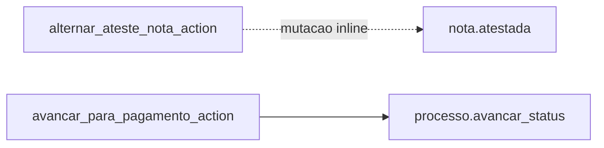

# Inventário de Actions — Pagamentos / Pré-pagamento

Este recorte cobre a preparação do processo antes da esteira de pagamento estrita: criação, edição modular, gestão fiscal dentro do processo, empenho e liquidação.

## Visão do recorte

| Namespace | Actions |
|---|---:|
| `pre_payment/cadastro` | 8 |
| `pre_payment/empenho` | 1 |
| `pre_payment/liquidacoes` | 2 |
| **Total** | **11** |

## Namespace `pre_payment/cadastro`

```mermaid
flowchart TD
    add_process_action --> _salvar_processo_completo
    editar_processo_capa_action --> _salvar_processo_completo
    editar_processo_documentos_action --> _salvar_formsets_em_transacao
    editar_processo_pendencias_action --> _atualizar_status_pendencia
    editar_processo_pendencias_action --> _salvar_formsets_em_transacao

    extrair_codigo_barras_documento_action --> processar_pdf_boleto
    extrair_codigo_barras_documento_action --> Boleto_Bancario_save[Boleto_Bancario.save]
    extrair_codigos_barras_lote_action --> _extrair_e_persistir_barcode
    _extrair_e_persistir_barcode --> processar_pdf_boleto
    _extrair_e_persistir_barcode --> Boleto_Bancario_save

    toggle_documento_fiscal_action -. mutacao inline .-> DocumentoFiscal_create_delete[DocumentoFiscal create/delete]
    toggle_documento_fiscal_action --> _sincronizar_totais_processo_fiscal

    salvar_nota_fiscal_action --> _atualizar_campos_nota
    salvar_nota_fiscal_action --> _salvar_retencoes
    salvar_nota_fiscal_action --> _sincronizar_totais_processo_fiscal
    salvar_nota_fiscal_action --> _atualizar_pendencia_ateste
```

| Action | Worker/helper/service acionado | Efeito principal |
|---|---|---|
| `add_process_action` | `_salvar_processo_completo` + `definir_status_inicial(...)` | cria a capa inicial do processo e decide status de entrada |
| `editar_processo_capa_action` | `_salvar_processo_completo` + `converter_para_extraorcamentario(...)` | atualiza capa e, quando aplicável, converte o processo |
| `editar_processo_documentos_action` | `_salvar_formsets_em_transacao` | persiste anexos e documentos orçamentários |
| `extrair_codigo_barras_documento_action` | `processar_pdf_boleto` + persistência em `Boleto_Bancario` | extrai linha digitável de um boleto já anexado |
| `extrair_codigos_barras_lote_action` | `_extrair_e_persistir_barcode` | faz a mesma extração em lote para todos os boletos do processo |
| `editar_processo_pendencias_action` | `_atualizar_status_pendencia` ou `_salvar_formsets_em_transacao` | atualiza uma pendência pontual ou salva o formset inteiro |
| `toggle_documento_fiscal_action` | mutação inline em `DocumentoFiscal` + `_sincronizar_totais_processo_fiscal` | marca ou desmarca um documento como fiscal |
| `salvar_nota_fiscal_action` | `_atualizar_campos_nota`, `_salvar_retencoes`, `_sincronizar_totais_processo_fiscal`, `_atualizar_pendencia_ateste` | salva nota, retenções e recalcula totais fiscais do processo |

## Namespace `pre_payment/empenho`

| Action | Worker/helper/service acionado | Efeito principal |
|---|---|---|
| `registrar_empenho_action` | `_registrar_empenho_e_anexar_siscac` | registra dados de empenho e anexa o documento SISCAC associado |

## Namespace `pre_payment/liquidacoes`

| Action | Worker/helper/service acionado | Efeito principal |
|---|---|---|
| `alternar_ateste_nota_action` | mutação inline na nota e pendências do processo | alterna ateste de liquidação |
| `avancar_para_pagamento_action` | `processo.avancar_status(...)` | move o processo para a etapa de pagamento quando os turnpikes passam |

## Leitura prática

- Se o problema é criação ou edição modular do processo, o centro real da escrita está em `_salvar_processo_completo` e `_salvar_formsets_em_transacao`.
- Se o problema é gestão fiscal dentro do processo, o encadeamento importante é `salvar_nota_fiscal_action` → `_salvar_retencoes` → `_sincronizar_totais_processo_fiscal`.
- Se o problema é passagem para a esteira financeira, a borda final deste recorte é `avancar_para_pagamento_action`.