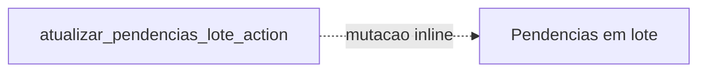
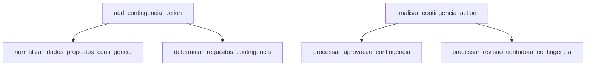
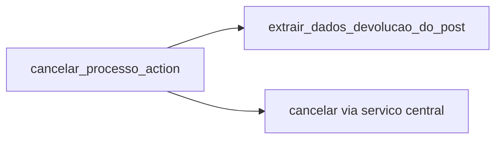
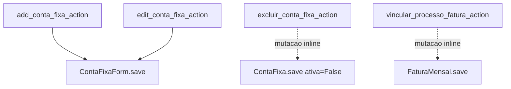

# Inventário de Actions — Pagamentos / Support

Este recorte cobre trilhas auxiliares e exceções operacionais do domínio financeiro: pendências, devoluções, contingências, cancelamento de processo e contas fixas.

## Visão do recorte

| Namespace | Actions |
|---|---:|
| `support/pendencia` | 1 |
| `support/devolucao` | 1 |
| `support/contingencia` | 2 |
| `support/cancelamento` | 1 |
| `support/contas_fixas` | 4 |
| **Total** | **9** |

## Namespace `support/pendencia`

| Action | Worker/helper/service acionado | Efeito principal |
|---|---|---|
| `atualizar_pendencias_lote_action` | mutação inline em lote | resolve, reabre ou ajusta múltiplas pendências de uma vez |

## Namespace `support/devolucao`

| Action | Worker/helper/service acionado | Efeito principal |
|---|---|---|
| `registrar_devolucao_action` | `form.save()` | registra devolução financeira/documental vinculada ao processo |

## Namespace `support/contingencia`

| Action | Worker/helper/service acionado | Efeito principal |
|---|---|---|
| `add_contingencia_action` | `normalizar_dados_propostos_contingencia` + `determinar_requisitos_contingencia` | abre a contingência e fixa suas exigências de análise |
| `analisar_contingencia_action` | `processar_aprovacao_contingencia` ou `processar_revisao_contadora_contingencia` | aprova, revisa ou rejeita a contingência conforme a etapa |

## Namespace `support/cancelamento`

| Action | Worker/helper/service acionado | Efeito principal |
|---|---|---|
| `cancelar_processo_action` | `extrair_dados_devolucao_do_post` + serviço central de cancelamento de processo | cancela formalmente o processo e cria devolução quando necessária |

## Namespace `support/contas_fixas`

| Action | Worker/helper/service acionado | Efeito principal |
|---|---|---|
| `add_conta_fixa_action` | `ContaFixaForm.save()` | cria conta fixa |
| `edit_conta_fixa_action` | `ContaFixaForm.save()` | atualiza conta fixa existente |
| `excluir_conta_fixa_action` | mutação inline com soft delete | inativa a conta fixa |
| `vincular_processo_fatura_action` | mutação inline em `FaturaMensal` | vincula uma fatura a um processo |

## Leitura prática

- Este é o bloco mais heterogêneo do domínio financeiro.
- `contingencia` e `cancelamento` já concentram melhor a regra em services/helpers centrais.
- `pendencia` e partes de `contas_fixas` ainda são bastante view-driven.