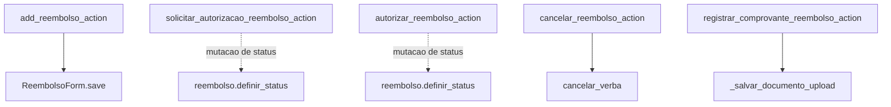
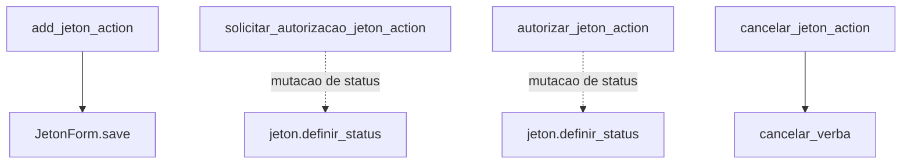
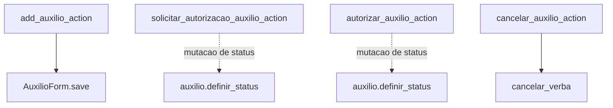
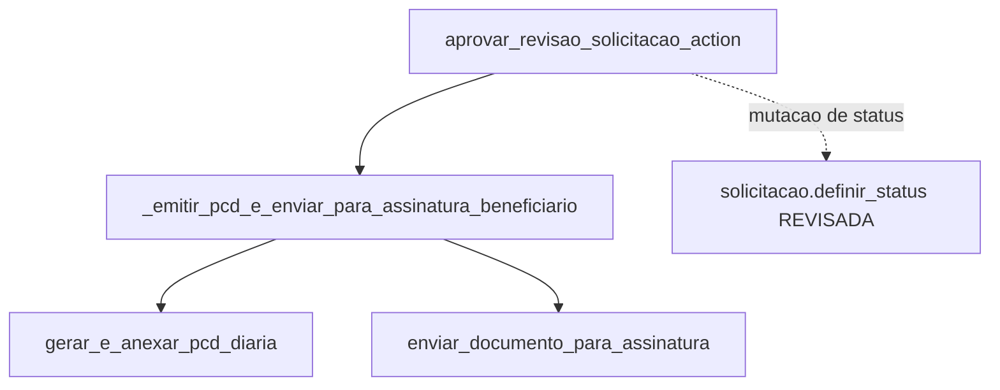

# Inventário de Actions — Verbas / Demais trilhas

Este recorte cobre reembolsos, jetons, auxílios e a revisão operacional de solicitações agrupáveis.

## Visão do recorte

| Namespace | Actions |
|---|---:|
| `verbas/reembolsos` | 5 |
| `verbas/jetons` | 4 |
| `verbas/auxilios` | 4 |
| `verbas/solicitacoes` | 1 |
| **Total** | **14** |

## Namespace `verbas/reembolsos`

| Action | Worker/helper/service acionado | Efeito principal |
|---|---|---|
| `add_reembolso_action` | `ReembolsoForm.save()` | cria reembolso |
| `solicitar_autorizacao_reembolso_action` | mutação de status | envia reembolso para autorização |
| `autorizar_reembolso_action` | mutação de status | autoriza reembolso |
| `cancelar_reembolso_action` | `cancelar_verba` | cancela reembolso e processa devolução quando couber |
| `registrar_comprovante_reembolso_action` | `_salvar_documento_upload` | anexa comprovante documental |

## Namespace `verbas/jetons`

| Action | Worker/helper/service acionado | Efeito principal |
|---|---|---|
| `add_jeton_action` | `JetonForm.save()` | cria jeton |
| `solicitar_autorizacao_jeton_action` | mutação de status | envia jeton para autorização |
| `autorizar_jeton_action` | mutação de status | autoriza jeton |
| `cancelar_jeton_action` | `cancelar_verba` | cancela jeton |

## Namespace `verbas/auxilios`

| Action | Worker/helper/service acionado | Efeito principal |
|---|---|---|
| `add_auxilio_action` | `AuxilioForm.save()` | cria auxílio |
| `solicitar_autorizacao_auxilio_action` | mutação de status | envia auxílio para autorização |
| `autorizar_auxilio_action` | mutação de status | autoriza auxílio |
| `cancelar_auxilio_action` | `cancelar_verba` | cancela auxílio |

## Namespace `verbas/solicitacoes`

| Action | Worker/helper/service acionado | Efeito principal |
|---|---|---|
| `aprovar_revisao_solicitacao_action` | `_emitir_pcd_e_enviar_para_assinatura_beneficiario`, `gerar_e_anexar_pcd_diaria`, `enviar_documento_para_assinatura` | revisa a solicitação, emite PCD e, no caso de diária, dispara assinatura eletrônica |

## Leitura prática

- Reembolsos, jetons e auxílios seguem um padrão quase espelhado: criar → solicitar autorização → autorizar → cancelar.
- O diferencial está em `reembolsos`, que também possui spoke documental explícita.
- A revisão de solicitações é o ponto onde verbas conversa com a infraestrutura transversal de assinatura eletrônica.