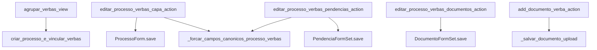
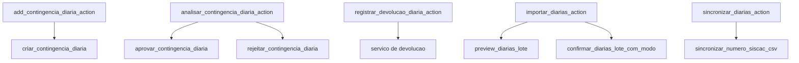

# Inventário de Actions — Verbas / Processo e Diárias

Este recorte junta o processo agregador de verbas e a trilha mais extensa do domínio: diárias, incluindo revisão de prestação, vínculo com processo, prestação de contas e cancelamento.

## Visão do recorte

| Namespace | Actions |
|---|---:|
| `verbas/processo` | 5 |
| `verbas/diarias` | 12 |
| `verbas/diarias/support` | 5 |
| **Total** | **22** |

## Namespace `verbas/processo`

| Action | Worker/helper/service acionado | Efeito principal |
|---|---|---|
| `agrupar_verbas_view` | `criar_processo_e_vincular_verbas` | consolida itens de verba em um processo financeiro |
| `editar_processo_verbas_capa_action` | `_forcar_campos_canonicos_processo_verbas` + `ProcessoForm.save()` | salva capa do processo de verbas e reaplica campos canônicos |
| `editar_processo_verbas_pendencias_action` | `PendenciaFormSet.save()` + `_forcar_campos_canonicos_processo_verbas` | atualiza pendências do processo de verbas |
| `editar_processo_verbas_documentos_action` | `DocumentoFormSet.save()` | persiste documentos do processo de verbas |
| `add_documento_verba_action` | `_salvar_documento_upload` | adiciona um documento pontual ao item ou processo de verba |

## Namespace `verbas/diarias`

```mermaid
flowchart TD
    iniciar_revisao_prestacoes_action -. fila em sessao .-> PRESTACAO_REVIEW_QUEUE_KEY
    sair_revisao_prestacoes_action -. limpa sessao .-> PRESTACAO_REVIEW_QUEUE_KEY

    add_diaria_action --> _salvar_diaria_base
    add_diaria_action --> gerar_e_anexar_scd_diaria
    add_diaria_assinada_action --> _salvar_diaria_base
    add_diaria_assinada_action --> anexar_solicitacao_assinada_diaria
    add_diaria_assinada_action --> gerar_e_anexar_pcd_diaria

    solicitar_autorizacao_diaria_action -. mutacao de status .-> definir_status_solicitada[diaria.definir_status SOLICITADA]
    autorizar_diaria_action -. mutacao de status .-> definir_status_aprovada[diaria.definir_status APROVADA]

    registrar_comprovante_action --> obter_ou_criar_prestacao
    registrar_comprovante_action --> ComprovanteDiariaFormSet_save[ComprovanteDiariaFormSet.save]
    encerrar_prestacao_action --> obter_ou_criar_prestacao
    encerrar_prestacao_action --> encerrar_prestacao
    encerrar_prestacao_action --> gerar_e_anexar_termo_prestacao_diaria

    vincular_diaria_processo_action --> vincular_diaria_em_processo_existente
    desvincular_diaria_processo_action --> desvincular_diaria_do_processo
    aceitar_prestacao_action --> aceitar_prestacao
    aceitar_prestacao_action --> gerar_e_anexar_termo_prestacao_diaria
    cancelar_diaria_action --> extrair_dados_devolucao_do_post
    cancelar_diaria_action --> cancelar_verba
```

| Action | Worker/helper/service acionado | Efeito principal |
|---|---|---|
| `iniciar_revisao_prestacoes_action` | fila em sessão | abre a sequência de revisão das prestações |
| `sair_revisao_prestacoes_action` | limpeza da fila em sessão | encerra a revisão em sequência |
| `add_diaria_action` | `_salvar_diaria_base` + `gerar_e_anexar_scd_diaria` quando complementação | cria diária em rascunho |
| `add_diaria_assinada_action` | `_salvar_diaria_base`, `anexar_solicitacao_assinada_diaria`, `gerar_e_anexar_pcd_diaria` | cria diária já aprovada com solicitação assinada |
| `solicitar_autorizacao_diaria_action` | mutação de status | envia a diária para autorização |
| `autorizar_diaria_action` | mutação de status com guarda do proponente | autoriza a diária |
| `registrar_comprovante_action` | `obter_ou_criar_prestacao` + `ComprovanteDiariaFormSet.save()` | grava comprovantes na prestação |
| `encerrar_prestacao_action` | `obter_ou_criar_prestacao`, `encerrar_prestacao`, `gerar_e_anexar_termo_prestacao_diaria` | encerra formalmente a prestação |
| `vincular_diaria_processo_action` | `vincular_diaria_em_processo_existente` | amarra a diária a um processo em pré-autorização |
| `desvincular_diaria_processo_action` | `desvincular_diaria_do_processo` | remove o vínculo com o processo |
| `aceitar_prestacao_action` | `aceitar_prestacao` + `gerar_e_anexar_termo_prestacao_diaria` | aceita a prestação e replica comprovantes para o processo |
| `cancelar_diaria_action` | `extrair_dados_devolucao_do_post` + `cancelar_verba` | cancela a diária e cria devolução quando necessária |

## Namespace `verbas/diarias/support`

| Action | Worker/helper/service acionado | Efeito principal |
|---|---|---|
| `add_contingencia_diaria_action` | `criar_contingencia_diaria` | abre retificação formal de diária |
| `analisar_contingencia_diaria_action` | `aprovar_contingencia_diaria` ou `rejeitar_contingencia_diaria` | decide a contingência |
| `registrar_devolucao_diaria_action` | serviço de devolução de diária | registra devolução paralela da diária |
| `importar_diarias_action` | `preview_diarias_lote` e `confirmar_diarias_lote_com_modo` | faz preview, confirmação ou cancelamento da importação em lote |
| `sincronizar_diarias_action` | `sincronizar_numero_siscac_csv` | concilia número SISCAC via CSV |

## Leitura prática

- Diárias são uma mini-plataforma dentro de verbas: cadastro, autorização, prestação, vínculo, revisão, contingência, devolução e sync.
- O centro do ciclo é `_salvar_diaria_base` na entrada e `aceitar_prestacao(...)` na saída operacional.
- A trilha de suporte de diárias já conversa com serviços especializados, o que a deixa mais legível do que parte do legado financeiro principal.