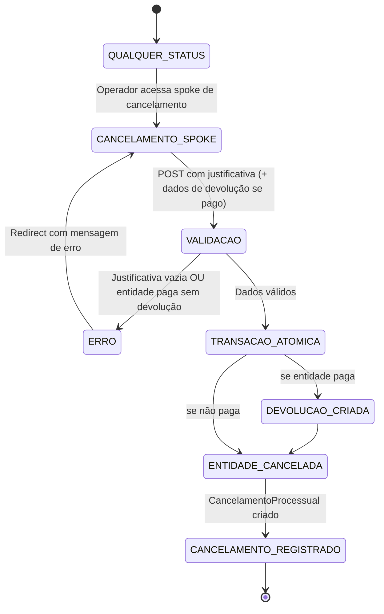

# Fluxo: Cancelamento

Este documento descreve o fluxo formal de cancelamento no PaGé — aplicável a processos de pagamento, verbas indenizatórias (diárias, reembolsos, jetons, auxílios) e suprimentos de fundos — incluindo a regra de **devolução obrigatória** quando a entidade já está em status pago.

---

## Regra central

Qualquer entidade pode ser cancelada a qualquer momento mediante justificativa obrigatória. Há, porém, uma restrição adicional para entidades já pagas:

!!! warning "Entidade paga → devolução obrigatória"
    Quando o cancelamento ocorre sobre uma entidade cujo status indica pagamento efetivado, o operador deve informar, no mesmo formulário, os dados de devolução correspondente. A `DevolucaoProcessual` é criada atomicamente na mesma transação do cancelamento.

| Entidade | Condição de "pago" |
|----------|-------------------|
| Processo | Status em `PAGO - EM CONFERÊNCIA`, `PAGO - A CONTABILIZAR`, `CONTABILIZADO - CONSELHO`, `APROVADO - PENDENTE ARQUIVAMENTO` ou `ARQUIVADO` |
| Verba indenizatória (diária, reembolso, jeton, auxílio) | `status_choice == "PAGA"` |
| Suprimento de fundos | `status_choice == "ENCERRADO"` |

---

## Diagrama de estados



---

## Fluxo por entidade

### 1. Cancelamento de Processo

**GET (spoke):** `cancelar_processo_spoke_view`  
**POST (ação):** `cancelar_processo_action`  
**Permissão:** `pagamentos.operador_contas_a_pagar`  
**Serviço:** `registrar_cancelamento_processo` (`pagamentos/services/cancelamentos.py`)

O botão "Cancelar Processo" aparece no hub `process_detail` para processos que ainda não estão cancelados.

Passos:

1. Operador acessa a spoke de cancelamento (`/processo/<pk>/cancelar/`).
2. O painel detecta se o processo está em status pago e sinaliza `processo_pago=True` no contexto.
3. Se `processo_pago`, o formulário exibe o card de devolução obrigatória com campos:
   - `valor_devolvido`
   - `data_devolucao`
   - `comprovante_devolucao` (arquivo PDF/JPG/PNG)
   - `motivo_devolucao` (opcional; gerado automaticamente se vazio)
4. O operador preenche a justificativa (obrigatória) e os dados de devolução (quando aplicável).
5. Na ação POST:
   - Valida justificativa.
   - Valida dados de devolução (se processo pago).
   - Em transação atômica:
     - Cria `DevolucaoProcessual` (se processo pago).
     - Define status do processo como `CANCELADO / ANULADO`.
     - Cria `CancelamentoProcessual` (tipo `PROCESSO`).
6. Redirect para `process_detail`.

---

### 2. Cancelamento de Verba Indenizatória

**Serviço:** `cancelar_verba` (`pagamentos/services/cancelamentos.py`)  
**Entidades suportadas:** `Diaria`, `ReembolsoCombustivel`, `Jeton`, `AuxilioRepresentacao`

| Verba | GET spoke | POST action | Permissão |
|-------|-----------|-------------|-----------|
| Diária | `cancelar_diaria_spoke_view` | `cancelar_diaria_action` | `verbas_indenizatorias.pode_gerenciar_diarias` |
| Reembolso | `cancelar_reembolso_spoke_view` | `cancelar_reembolso_action` | `verbas_indenizatorias.pode_gerenciar_reembolsos` |
| Jeton | `cancelar_jeton_spoke_view` | `cancelar_jeton_action` | `verbas_indenizatorias.pode_gerenciar_jetons` |
| Auxílio | `cancelar_auxilio_spoke_view` | `cancelar_auxilio_action` | `verbas_indenizatorias.pode_gerenciar_auxilios` |

Passos comuns:

1. Spoke renderiza o formulário; se `status_choice == "PAGA"`, passa `entidade_paga=True` ao template.
2. Template inclui o partial `_cancelamento_devolucao.html` com campos de devolução quando `entidade_paga`.
3. Na ação POST:
   - Localiza o `Processo` vinculado à verba.
   - Valida justificativa e dados de devolução (se verba paga).
   - Em transação atômica:
     - Cria `DevolucaoProcessual` no processo vinculado (se verba paga).
     - Define status do processo como `CANCELADO / ANULADO`.
     - Define status da verba como `CANCELADO / ANULADO`; se aplicável, marca `autorizada=False`.
     - Cria `CancelamentoProcessual` com tipo correspondente à verba e FK para o objeto.

---

### 3. Cancelamento de Suprimento

**GET (spoke):** `cancelar_suprimento_spoke_view`  
**POST (ação):** `cancelar_suprimento_action`  
**Permissão:** `suprimentos.acesso_backoffice`  
**Serviço:** `cancelar_suprimento` (`pagamentos/services/cancelamentos.py`)

Condição de pago: `status_choice == "ENCERRADO"`.

Passos:

1. Spoke detecta se `status_choice == "ENCERRADO"` e passa `entidade_paga=True`.
2. Formulário exibe campos de devolução quando aplicável.
3. Na ação POST:
   - Valida justificativa e dados de devolução (se encerrado).
   - Em transação atômica:
     - Cria `DevolucaoProcessual` no processo vinculado (se encerrado).
     - Define status do processo como `CANCELADO / ANULADO`.
     - Define status do suprimento como `CANCELADO / ANULADO`.
     - Cria `CancelamentoProcessual` (tipo `SUPRIMENTO`).

---

## Modelo de dados

### `CancelamentoProcessual`

Registro formal de cancelamento vinculado ao processo e opcionalmente à entidade cancelada.

| Campo | Tipo | Descrição |
|-------|------|-----------|
| `processo` | FK `Processo` | Processo financeiro afetado |
| `tipo` | choice | `PROCESSO`, `DIARIA`, `REEMBOLSO`, `JETON`, `AUXILIO`, `SUPRIMENTO` |
| `justificativa` | TextField | Motivo obrigatório |
| `registrado_por` | FK User | Quem executou o cancelamento |
| `diaria` / `reembolso` / `jeton` / `auxilio` / `suprimento` | FK nullable | Referência à entidade cancelada |

### `DevolucaoProcessual` (criada atomicamente quando pago)

| Campo | Tipo | Descrição |
|-------|------|-----------|
| `processo` | FK `Processo` | Processo ao qual pertence a devolução |
| `valor_devolvido` | DecimalField | Valor efetivamente devolvido |
| `data_devolucao` | DateField | Data da devolução |
| `motivo` | TextField | Motivo (gerado automaticamente se não informado) |
| `comprovante` | FileField | GRU, depósito ou outro comprovante |

Histórico em `django-simple-history` em ambos os modelos.

---

## Infraestrutura compartilhada

### Serviço central

`pagamentos/services/cancelamentos.py` concentra toda a lógica de negócio do cancelamento. As views são roteadoras; nenhuma lógica de mutação fica nas actions.

```python
# API pública do serviço
registrar_cancelamento_processo(processo, justificativa, usuario, dados_devolucao=None)
cancelar_verba(verba, justificativa, usuario, dados_devolucao=None)
cancelar_suprimento(suprimento, justificativa, usuario, dados_devolucao=None)

# Helper de extração de dados do POST
extrair_dados_devolucao_do_post(request) -> dict | None
```

### Partial de devolução

`commons/templates/commons/partials/_cancelamento_devolucao.html`

Incluído por todos os templates de spoke de cancelamento. Renderiza o card de devolução obrigatória apenas quando `entidade_paga` é `True` no contexto.

### Formulário com `multipart/form-data`

Todos os templates de cancelamento usam `enctype="multipart/form-data"` para suportar o upload do comprovante de devolução.

---

## Referências de código

| Componente | Localização |
|-----------|------------|
| Serviço central | `pagamentos/services/cancelamentos.py` |
| Spoke/action de processo | `pagamentos/views/support/cancelamento/` |
| Spokes/actions de verbas | `verbas_indenizatorias/views/{diarias,reembolsos,jetons,auxilios}/` |
| Spoke/action de suprimento | `suprimentos/views/prestacao_contas/panels.py` e `actions.py` |
| Partial de devolução | `commons/templates/commons/partials/_cancelamento_devolucao.html` |
| Modelos (`CancelamentoProcessual`, `DevolucaoProcessual`) | `pagamentos/domain_models/suporte.py` |
| Template spoke processo | `pagamentos/templates/pagamentos/cancelar_processo_spoke.html` |
