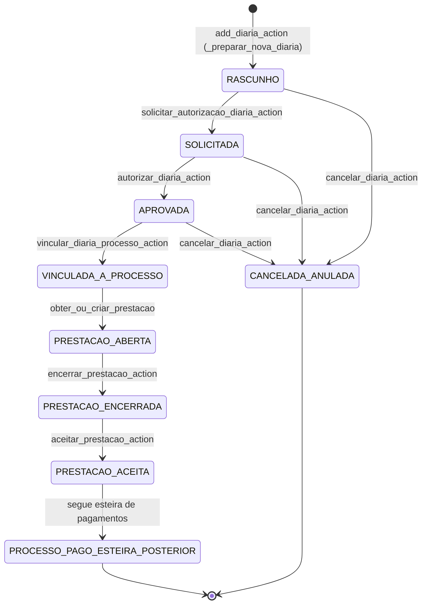

# Fluxo: Diárias

Este documento descreve o ciclo operacional completo de uma diária no PaGé — do cadastro ao encerramento da prestação de contas — incluindo vínculo com processo de pagamento, assinatura eletrônica, devolução e contingência.

---

## Diagrama de workflow (visão macro)



---

## 1. Modelo de domínio

`Diaria` (`verbas_indenizatorias/models.py`) é a entidade central. Ao ser salva, o modelo:

- Recalcula `quantidade_diarias` automaticamente pelo intervalo de datas e tipo.
- Recalcula `valor_total` com base na tabela `Tabela_Valores_Unitarios_Verbas_Indenizatorias` para o cargo/função do beneficiário.
- Chama `full_clean()` antes de persistir, verificando conflitos de período e regras de complementação.

### Domain Seal (pós-pagamento)

Quando a diária está vinculada a um processo em estágio `PAGO` ou posterior, mutações diretas em campos sensíveis são bloqueadas em `save()` e `delete()`. A única exceção autorizada é via **Contingência aprovada** com bypass controlado (`_bypass_domain_seal = True`).

### Campos protegidos pós-pagamento

`beneficiario`, `proponente`, `tipo_solicitacao`, `data_saida`, `data_retorno`, `cidades`, `objetivo`, `quantidade_diarias`, `valor_total`, `meio_de_transporte`, `autorizada`, `numero_siscac`, `processo`.

---

## 2. Criação

**View:** `add_diaria_view` / **Action:** `add_diaria_action`  
**Permissão:** `verbas_indenizatorias.pode_criar_diarias`

1. Operador preenche o formulário (`DiariaForm`).
2. `_preparar_nova_diaria` define a diária como **rascunho** (`autorizada=False`, status `RASCUNHO`).
3. Se tipo for `COMPLEMENTACAO`, o sistema gera e anexa o **SCD** (Solicitação de Complementação de Diária).
4. Redirecionamento para `gerenciar_diaria`.

### Etapas de autorização

Após o cadastro, a diária segue o fluxo explícito de autorização:

1. `solicitar_autorizacao_diaria_action`: `RASCUNHO → SOLICITADA`.
2. `autorizar_diaria_action`: `SOLICITADA → APROVADA` (e marca `autorizada=True`).

---

## 3. Hub de gerenciamento

**View:** `gerenciar_diaria_view`  
**Permissão:** `verbas_indenizatorias.pode_gerenciar_diarias`

Exibe:
- Dados da diária (status, beneficiário, datas, valor calculado).
- Prestação de contas com comprovantes.
- Spokes de ação (cartões de navegação):

| Spoke | Finalidade |
|-------|-----------|
| `vinculo_diaria_spoke` | Vincular/desvincular do processo de pagamento |
| `devolucao_diaria_spoke` | Registrar devolução parcial de valor |
| `apostila_diaria_spoke` | Apostilar correções formais |
| `cancelar_diaria_spoke` | Cancelar/anular a diária |

---

## 4. Vínculo com processo de pagamento

**Action:** `vincular_diaria_processo_action` / `desvincular_diaria_processo_action`

Regras:
- Vínculo e desvínculo permitidos **somente** enquanto o processo estiver em status pré-autorização (`STATUS_PROCESSO_PRE_AUTORIZACAO`).
- Após vínculo, `_recalcular_totais_processo_verbas` sincroniza os valores bruto/líquido do processo somando diárias + reembolsos + jetons + auxílios.
- O tipo de pagamento do processo é forçado para **VERBAS INDENIZATÓRIAS**.
- O campo `extraorcamentario` do processo é zerado automaticamente.

---

## 5. Prestação de contas

### Ciclo do beneficiário

1. `PrestacaoContasDiaria` é criada automaticamente ao primeiro acesso (`obter_ou_criar_prestacao`), com status `ABERTA`.
2. Beneficiário (ou operador com permissão `operar_prestacao_contas`) registra comprovantes via `registrar_comprovante_action`.
3. Ao encerrar (`encerrar_prestacao_action`): status muda para `ENCERRADA`, metadados de encerramento são gravados, e o **Termo de Prestação** é gerado e anexado automaticamente.

### Revisão pela equipe interna

**Views:** `painel_revisar_prestacoes_view` / `revisar_prestacao_view`  
**Permissão:** `verbas_indenizatorias.analisar_prestacao_contas`

- O analista revisa os comprovantes do beneficiário.
- `aceitar_prestacao_action`:
  - Exige que a diária esteja vinculada a um processo.
  - Replica todos os `DocumentoComprovacao` como `DocumentoProcesso` no processo.
  - Encerra a prestação.
  - Gera o Termo de Prestação.

---

## 6. Assinatura eletrônica (Autentique)

**Action:** `aprovar_revisao_solicitacao_action` (quando `tipo_verba=diaria`)  
**Permissão:** `pagamentos.pode_operar_contas_pagar`

1. Na aprovação da revisão operacional da diária (`APROVADA -> REVISADA`), o sistema emite/recupera o PCD.
2. Envia o PDF para a Autentique via `enviar_documento_para_assinatura`.
3. Grava `autentique_id`, `autentique_url` e status `PENDENTE` na assinatura.
4. O fluxo não é mais disparado no hub `gerenciar_diaria`.

**Sincronização:** `sincronizar_assinatura_view` verifica o status na Autentique e baixa o PDF assinado quando disponível.  
**Reenvio:** `reenviar_assinatura_view` reenvia o rascunho SCD para nova rodada de assinaturas.

---

## 7. Devolução

**Views:** `painel_devolucoes_diarias_view` / `registrar_devolucao_diaria_view`  
**Action:** `registrar_devolucao_diaria_action`

- Cria um registro `DevolucaoDiaria` vinculado à diária, com data, valor e motivo.
- `clean()` valida que `valor_devolvido` não exceda `diaria.valor_total`.
- **Não altera** o valor total da diária diretamente; a devolução é um registro paralelo para rastreabilidade auditável.

---

## 8. Contingência

**Views:** `painel_contingencias_diarias_view` / `add_contingencia_diaria_view`  
**Actions:** `add_contingencia_diaria_action` / `analisar_contingencia_diaria_action`

### Ciclo de vida

```
PENDENTE_SUPERVISOR → APROVADA (campo aplicado à diária)
                   → REJEITADA (sem efeito na diária)
```

### Campos permitidos para retificação via contingência

`numero_siscac`, `cidade_origem`, `cidade_destino`, `objetivo`, `proponente_id`, `meio_de_transporte_id`

### Aplicação

Ao aprovar, `_aplicar_contingencia_diaria` usa `_bypass_domain_seal = True` para permitir a mutação do campo específico mesmo com processo selado. O bypass é garantidamente removido após o `save()` via bloco `try/finally`.

---

## 9. Cancelamento

**Spoke (GET):** `cancelar_diaria_spoke_view`  
**Action (POST):** `cancelar_diaria_action`  
**Permissão:** `verbas_indenizatorias.pode_gerenciar_diarias`  
**Serviço:** `cancelar_verba` (`pagamentos/services/cancelamentos.py`)

- Justificativa é sempre obrigatória.
- **Quando a diária está com `status_choice == "PAGA"`**, o formulário exige os dados de devolução correspondente (valor, data e comprovante). A `DevolucaoProcessual` é criada atomicamente na mesma transação.
- A transação atômica:
  1. Cria `DevolucaoProcessual` no processo vinculado (se paga).
  2. Define status do processo como `CANCELADO / ANULADO`.
  3. Define status da diária como `CANCELADO / ANULADO` e `autorizada=False`.
  4. Grava `CancelamentoProcessual` (tipo `DIARIA`).

Consulte o [Fluxo de Cancelamento](cancelamento.md) para a especificação completa, incluindo o partial compartilhado de devolução.

---

## Referências de código

| Componente | Localização |
|-----------|------------|
| Modelos | `verbas_indenizatorias/models.py` |
| Painel / spokes (GET) | `verbas_indenizatorias/views/diarias/panels.py` |
| Ações principais (POST) | `verbas_indenizatorias/views/diarias/actions.py` |
| Devolução | `verbas_indenizatorias/views/diarias/devolucao/` |
| Contingência | `verbas_indenizatorias/views/diarias/contingencia/` |
| Assinaturas | `verbas_indenizatorias/views/diarias/signatures.py` |
| Serviço de prestação | `verbas_indenizatorias/services/prestacao.py` |
| Serviço de vínculo | `verbas_indenizatorias/services/vinculos_diaria.py` |
| Serviço de contingência | `verbas_indenizatorias/services/contingencia.py` |
