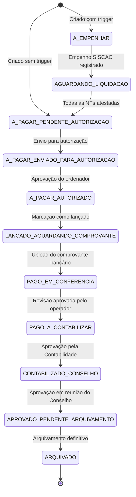
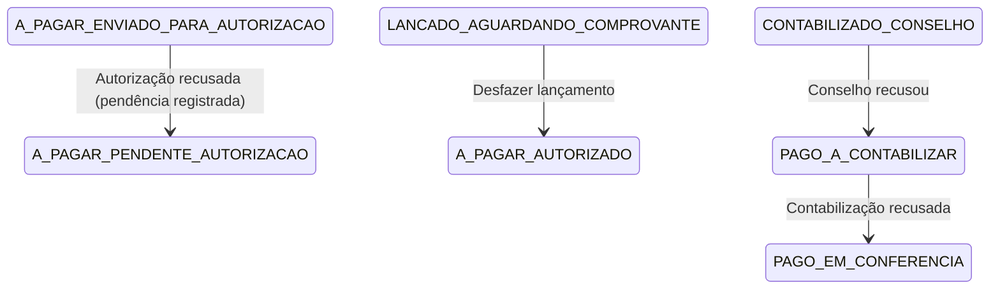
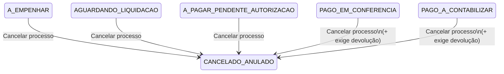
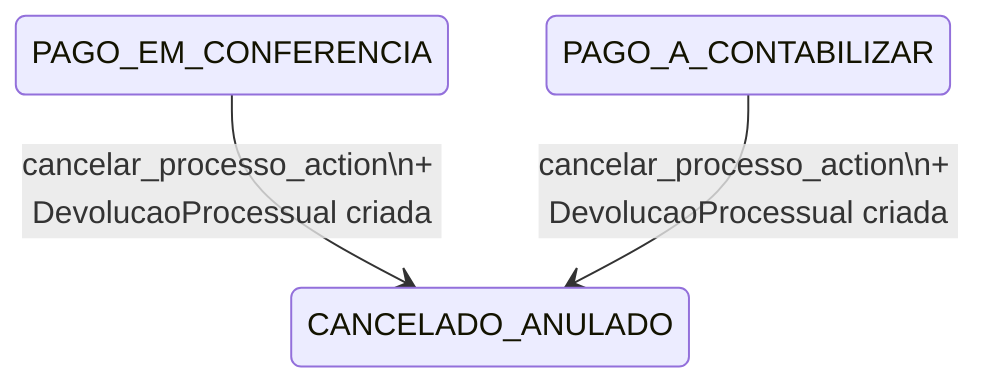
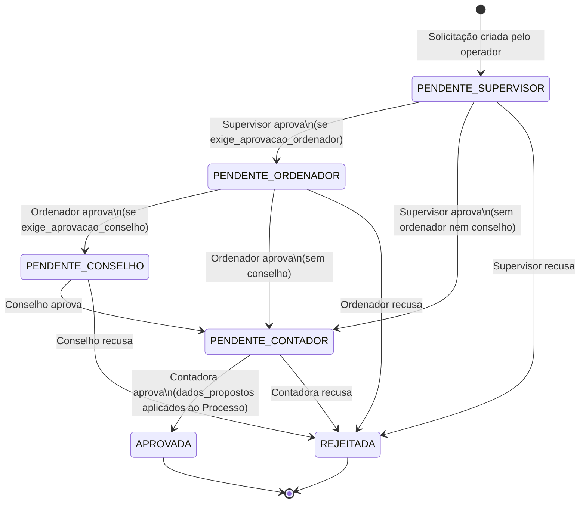

# Fluxo: Pagamentos

Este documento descreve a esteira completa de um processo de pagamento no PaGé — da criação até o arquivamento — incluindo as filas operacionais, transições de status e pontos de controle (turnpikes).

---

## 1. Fluxo feliz (Happy Flow)

Caminho principal sem interrupções, do nascimento ao arquivamento. Os status são constantes definidas em `ProcessoStatus` (`pagamentos/domain_models/processos.py`).

---

## 2. Exceções e devoluções de etapa

Desvios do fluxo principal causados por recusa de aprovadores. O processo retorna a um status anterior sem cancelamento.

| Etapa de recusa | Status de retorno |
|-----------------|-------------------|
| Autorização recusada | `A PAGAR - PENDENTE AUTORIZAÇÃO` |
| Lançamento desfeito | `A PAGAR - AUTORIZADO` |
| Contabilização recusada | `PAGO - EM CONFERÊNCIA` |
| Conselho recusado | `PAGO - A CONTABILIZAR` |

---

## 3. Cancelamento

Acionado pelo operador via `cancelar_processo_action`. Disponível enquanto o processo não estiver arquivado. Consulte o [Fluxo de Cancelamento](cancelamento.md) para a especificação completa.

---

## 4. Devolução processual

Quando o processo já foi pago e o cancelamento é necessário, o operador deve informar os dados da devolução junto com o cancelamento. A `DevolucaoProcessual` é criada atomicamente na mesma transação.

Campos obrigatórios na devolução: **valor devolvido**, **data da devolução** e **comprovante de devolução**.

---

## 5. Contingência

Fluxo de aprovação multi-etapa para retificações formais em dados do processo. O processo permanece no seu status atual enquanto a contingência tramita. Após aprovação final, os `dados_propostos` são aplicados atomicamente.

| Etapa | Permissão necessária |
|-------|----------------------|
| Supervisão | `pode_aprovar_contingencia_supervisor` |
| Ordenador | `pode_aprovar_contingencia_ordenador` |
| Conselho Fiscal | `pode_aprovar_contingencia_conselho` |
| Revisão Contadora | `pode_revisar_contingencia_contadora` |

---

## 6. Criação do processo

**View:** `add_process_view` / **Action:** `add_process_action`  
**Permissão:** `pagamentos.operador_contas_a_pagar`

- O operador preenche a capa: credor, tipo de pagamento, valores, datas.
- O campo `trigger_a_empenhar` define o status inicial:
  - Com trigger ✓ → `A EMPENHAR`
  - Sem trigger → `A PAGAR - PENDENTE AUTORIZAÇÃO`
- Processo criado via `_salvar_processo_completo` dentro de transação atômica.

---

## 7. Hub de edição modular

**View:** `editar_processo` (GET)  
**Template:** `pagamentos/editar_processo_hub.html`

O hub é um **Command Center somente-leitura** com cartões de acesso às spokes:

- **Capa** — dados principais do processo.
- **Documentos** — anexos e documentos orçamentários.
- **Pendências** — pendências administrativas.
- **Liquidações e retenções** — notas fiscais, ateste e dados fiscais.

Exibe peek tables paginadas de documentos recentes, liquidações e pendências.

!!! note
    Retenções não possuem card/tabela própria no hub; estão consolidadas sob "Liquidações e retenções" conforme a spoke `documentos_fiscais`.

---

## 8. Etapa de empenho

**View:** `a_empenhar_view`  
**Permissão:** `pagamentos.pode_operar_contas_pagar`

- Lista processos no status `A EMPENHAR` com filtros e ordenação.
- O operador registra o empenho (número, data, valor) via importação de PDF SISCAC ou manualmente.
- Turnpike de saída: exige **Documento Orçamentário** (exceto extra-orçamentários).
- Transição: `A EMPENHAR → AGUARDANDO LIQUIDAÇÃO`.

---

## 9. Liquidação e ateste

**View:** `painel_liquidacoes_view`  
**Permissão:** `pagamentos.operador_contas_a_pagar`

- O Fiscal de Contrato visualiza somente suas NFs; gestores/ordenadores veem todas.
- Spoke `documentos_fiscais_view`: associa documento à nota fiscal, informa dados da NF e registra retenções.
- `alternar_ateste_nota_action`: alterna `nota.atestada`; cria/remove pendência de ateste de liquidação.
- Transição: `AGUARDANDO LIQUIDAÇÃO → A PAGAR - PENDENTE AUTORIZAÇÃO` (via `avancar_para_pagamento_action`).
- Turnpike: todas as NFs do processo devem estar atestadas e valores devem ser consistentes.

---

## 10. Contas a pagar e envio para autorização

**View:** `contas_a_pagar`  
**Permissão:** `pagamentos.pode_operar_contas_pagar`

- Fila com filtros facetados (data, forma de pagamento, status, conta).
- Colunas anotadas: `has_pendencias`, `has_retencoes`.
- Ação de envio em lote: `A PAGAR - PENDENTE AUTORIZAÇÃO → A PAGAR - ENVIADO PARA AUTORIZAÇÃO`.

---

## 11. Autorização

**View:** `painel_autorizacao_view`  
**Permissão:** `pagamentos.pode_autorizar_pagamento`

Duas filas simultâneas: pendentes de autorização e já autorizados.

- **Autorizar em lote:** `A PAGAR - ENVIADO PARA AUTORIZAÇÃO → A PAGAR - AUTORIZADO`.
- **Recusar** (por processo): devolve para `A PAGAR - PENDENTE AUTORIZAÇÃO` com pendência registrada.

---

## 12. Lançamento bancário

**Views:** `lancamento_bancario` / `marcar_como_lancado_action`  
**Permissão:** `pagamentos.pode_operar_contas_pagar`

1. Operador seleciona processos autorizados → IDs armazenados em **sessão** (`processos_lancamento`).
2. Painel exibe dois grupos: *a pagar* e *já lançados*, com totais consolidados por forma de pagamento.
3. Cada processo exibe instruções de pagamento conforme forma (código de barras, PIX, TED, remessa).
4. Marcar como lançado: `A PAGAR - AUTORIZADO → LANÇADO - AGUARDANDO COMPROVANTE`.
5. Desfazer lançamento retorna para `A PAGAR - AUTORIZADO`.

---

## 13. Upload de comprovantes

**View:** `painel_comprovantes_view` / **Action:** `vincular_comprovantes_action` (JSON API)  
**Permissão:** `pagamentos.pode_operar_contas_pagar`

1. Operador faz upload dos arquivos de comprovante (via interface interativa).
2. Para cada comprovante, sistema cria:
   - `DocumentoProcesso` (tipo "Comprovante de Pagamento", ordem 99).
   - `ComprovanteDePagamento` com metadados (credor, valor pago, data, número).
3. Processo avança para `PAGO - EM CONFERÊNCIA`.
4. `data_pagamento` do processo é atualizado.
5. Retenções com `codigo.regra_competencia == "pagamento"` têm sua competência recalculada.

---

## 14. Conferência

**Views:** `painel_conferencia_view` / `conferencia_processo_view`  
**Permissão:** `pagamentos.pode_operar_contas_pagar`

- Fila de processos `PAGO - EM CONFERÊNCIA` com filtros: com pendência, com retenção, ambos, sem pendências.
- Revisão detalhada em fila de sessão (`conferencia_queue`).
- Aprovação: `PAGO - EM CONFERÊNCIA → PAGO - A CONTABILIZAR`.
- Permite salvar ajustes durante a revisão.

---

## 15. Contabilização

**Views:** `painel_contabilizacao_view` / `contabilizacao_processo_view`  
**Permissão:** `pagamentos.pode_contabilizar`

- Revisão em fila de sessão (`contabilizacao_queue`).
- Aprovação: `PAGO - A CONTABILIZAR → CONTABILIZADO - PARA APRECIAÇÃO DE CONSELHO FISCAL`.
- Recusa: devolve para `PAGO - EM CONFERÊNCIA`.

---

## 16. Conselho fiscal

**Views:** `painel_conselho_view` / `analise_reuniao_view` / `conselho_processo_view`  
**Permissão:** `pagamentos.pode_auditar_conselho`

1. Criação de `ReuniaoConselho` (número, trimestre, data).
2. Montagem de pauta: associar processos `CONTABILIZADO...` à reunião.
3. Iniciar análise coloca reunião em status `EM_ANALISE` e abre fila de sessão (`conselho_queue`).
4. Aprovação: `CONTABILIZADO... → APROVADO - PENDENTE ARQUIVAMENTO`.
5. Recusa: devolve para `PAGO - A CONTABILIZAR`.
6. Processo somente aceito se vinculado a reunião ativa.

---

## 17. Arquivamento

**Views:** `painel_arquivamento_view` / `arquivar_processo_action`  
**Permissão:** `pagamentos.pode_arquivar`

- Exibe pendentes (`APROVADO - PENDENTE ARQUIVAMENTO`) e histórico com filtro.
- Arquivamento definitivo: `_executar_arquivamento_definitivo` → `ARQUIVADO`.
- Guard: processo sem documentos gera `ArquivamentoSemDocumentosError`.

---

## 18. Cancelamento e devolução

**View (spoke):** `cancelar_processo_spoke_view`  
**Action:** `cancelar_processo_action`  
**Permissão:** `pagamentos.operador_contas_a_pagar`  
**Serviço:** `registrar_cancelamento_processo` (`pagamentos/services/cancelamentos.py`)

- O botão "Cancelar Processo" é exibido no hub `process_detail` para processos que ainda não estão cancelados.
- Justificativa é sempre obrigatória.
- **Quando o processo está em status pago ou posterior**, o operador deve também informar os dados de devolução correspondente (valor, data e comprovante). A `DevolucaoProcessual` é criada atomicamente na mesma transação do cancelamento.
- Status final: `CANCELADO / ANULADO`. O `CancelamentoProcessual` é gravado como trilha formal.

Consulte o [Fluxo de Cancelamento](cancelamento.md) para a especificação completa.

---

## 19. Contingência

**Serviço:** `pagamentos/services/contingencias.py`  
**Permissões:** `pode_aprovar_contingencia_supervisor`, `_ordenador`, `_conselho`, `pode_revisar_contingencia_contadora`

- Solicitação formal de retificação de dados do processo após sua criação.
- A aprovação é multi-etapa e configurável: supervisor → (ordenador opcional) → (conselho opcional) → contadora.
- O processo permanece no seu status atual enquanto a contingência tramita.
- Após aprovação final pela contadora, os `dados_propostos` são aplicados atomicamente ao `Processo`.
- Em caso de rejeição em qualquer etapa, a contingência é encerrada sem alterar o processo.

---

## Referências de código

| Cancelamento de código | Localização |
|-------|------------|
| Criação / hub | `pagamentos/views/pre_payment/cadastro/` |
| Empenho | `pagamentos/views/pre_payment/empenho/` |
| Liquidação | `pagamentos/views/pre_payment/liquidacoes/` |
| Contas a pagar / autorização | `pagamentos/views/payment/` |
| Comprovantes | `pagamentos/views/payment/comprovantes/` |
| Conferência | `pagamentos/views/post_payment/conferencia/` |
| Contabilização | `pagamentos/views/post_payment/contabilizacao/` |
| Conselho | `pagamentos/views/post_payment/conselho/` e `reunioes/` |
| Arquivamento | `pagamentos/views/post_payment/arquivamento/` |
| **Cancelamento** | **`pagamentos/views/support/cancelamento/`** |
| **Serviço de cancelamento** | **`pagamentos/services/cancelamentos.py`** |
| Helpers de lote / fila | `pagamentos/views/helpers/payment_builders.py` |
| Domínio / status | `pagamentos/domain_models/processos.py` |
