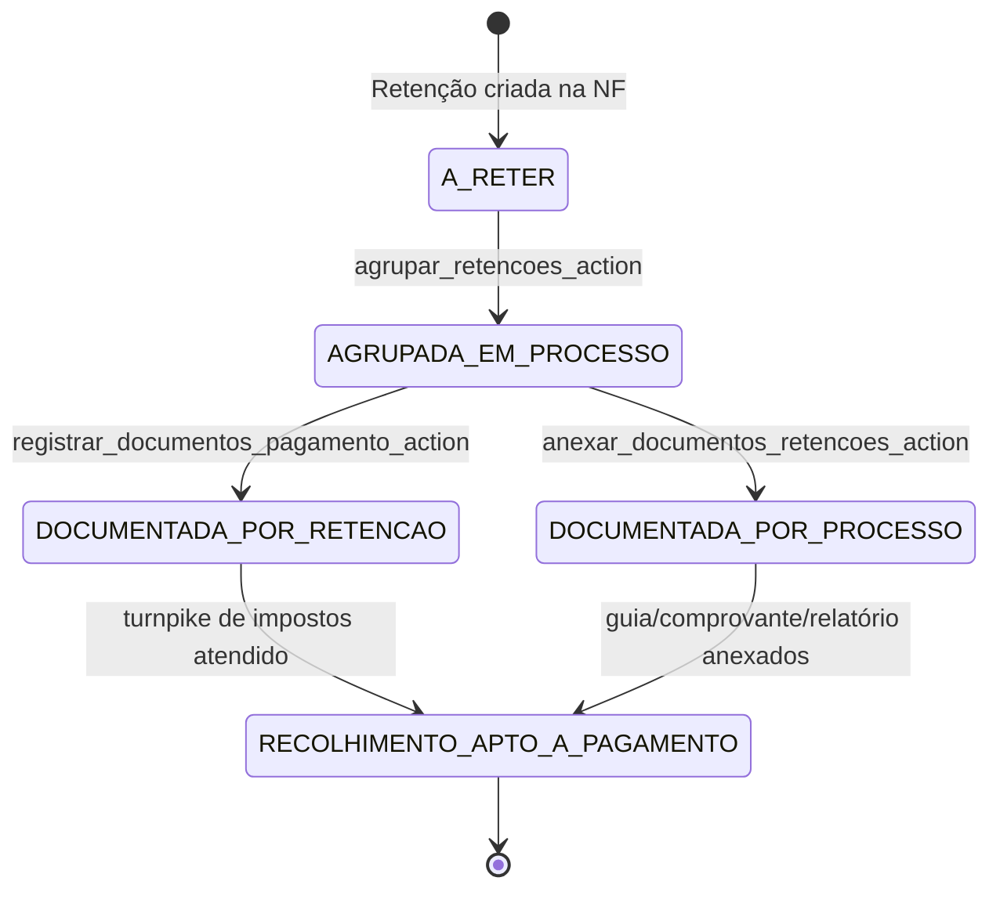

# Fluxo: Retenções de Impostos

Este documento descreve o ciclo completo de vida de uma `RetencaoImposto` — desde o registro na nota fiscal até a documentação de recolhimento junto à Receita Federal.

---

## Diagrama de workflow (visão macro)

---

## 1. Origem da retenção

Uma retenção nasce a partir da gestão de documentos fiscais de um processo de pagamento:

1. O operador acessa a spoke **"Liquidações e retenções"** no hub do processo (`documentos_fiscais`).
2. Um documento é marcado como fiscal (`toggle_documento_fiscal_action`), gerando um `DocumentoFiscal` vinculado.
3. Na tela de gestão da nota (`documentos_fiscais.html`), o operador informa os dados da NF e adiciona linhas de retenção via payload JSON.
4. O endpoint `salvar_nota_fiscal_action` (POST) persiste a nota e chama `_salvar_retencoes`.

### Regras de `_salvar_retencoes`

- **Atualização in-place** dos registros existentes, ordenados por `id`, sem recriar do zero (preserva histórico via `simple_history`).
- **Criação** de novas linhas além da quantidade existente — status `"A RETER"` atribuído somente nas criações.
- **Exclusão** das linhas que excedem o payload enviado.
- Após persistência, recalcula `nota.valor_liquido` e os totais do processo (`_sincronizar_totais_processo_fiscal`).

!!! warning "Guard de pós-pagamento"
    `_status_bloqueia_gestao_fiscal` impede qualquer mutação fiscal quando o processo já atingiu o estágio `PAGO - EM CONFERÊNCIA` ou posterior, exceto se uma contingência estiver ativa.

---

## 2. Painel operacional de retenções

**URL name:** `painel_impostos_view`  
**Permissão:** `fiscal.acesso_backoffice`

O painel suporta três visões selecionáveis via `?visao=`:

| Visão | Dataset | Filtro |
|-------|---------|--------|
| `individual` | `RetencaoImposto` | `RetencaoIndividualFilter` |
| `nf` | `DocumentoFiscal` c/ anotações | `RetencaoNotaFilter` |
| `processo` | `Processo` c/ anotações | `RetencaoProcessoFilter` |

Na visão `individual`, para cada retenção é calculado se possui `DocumentoPagamentoImposto` completo (relatório + guia + comprovante todos preenchidos).

---

## 3. Agrupamento para recolhimento

**Action:** `agrupar_retencoes_action` (POST)

Fluxo:

1. Operador seleciona retenções sem `processo_pagamento` (flag "Pendente" no painel).
2. O sistema cria um novo `Processo` com:
   - credor **"Órgão Arrecadador (A Definir)"**,
   - tipo pagamento **IMPOSTOS**,
   - status inicial **A PAGAR - PENDENTE AUTORIZAÇÃO**,
   - valor = soma dos valores das retenções selecionadas.
3. Cada retenção recebe `processo_pagamento = novo_processo`.
4. O operador é redirecionado para o hub do novo processo.

A partir desse ponto, o processo de recolhimento segue a esteira normal de pagamentos.

---

## 4. Documentação de recolhimento — dois trilhos

### Trilho A: Documentação por retenção (`DocumentoPagamentoImposto`)

Usado para registrar comprovante individual por retenção (relatório + guia + comprovante).

1. Operador seleciona retenções → `selecionar_retencoes_documentacao_action` valida IDs e redireciona para a spoke com `?ids=1,2,3`.
2. A spoke `registrar_documentos_pagamento_view` (GET) renderiza a lista de retenções para revisão.
3. Operador pode remover retenções da lista (`remover_retencao_documentacao_action`) sem alterar banco — apenas ajusta a query string.
4. Ao submeter, `registrar_documentos_pagamento_action` (POST) chama `criar_documentos_pagamento_impostos`:
   - idempotente via `get_or_create(retencao, codigo_imposto, competencia)`;
   - cria um `DocumentoPagamentoImposto` por retenção elegível;
   - retenções que já possuem documento são ignoradas (reportadas ao operador).

!!! note "Fluxo stateless"
    Os IDs das retenções trafegam via query param `?ids=` (GET) e `<input type="hidden" name="retencao_ids">` (POST). Não há dependência de sessão.

### Trilho B: Anexação de guia/comprovante ao processo de recolhimento

Usado para anexar os documentos de competência mensal diretamente ao processo DARF.

1. `anexar_documentos_retencoes_action` (POST) recebe arquivos de guia e comprovante + mês/ano de referência.
2. Filtra retenções pelo mês/ano (`competencia__month`, `competencia__year`) já agrupadas.
3. Para cada processo de recolhimento distinto envolvido, chama `anexar_guia_comprovante_relatorio_em_processos`:
   - Gera relatório CSV consolidado por código de imposto (`gerar_relatorio_retencoes_mensal_csv`).
   - Cria três `DocumentoProcesso` (guia, comprovante, relatório) com ordens 97–99.

---

## 5. Guard na transição para PAGO

Na etapa de comprovantes (`vincular_comprovantes_action`), ao avançar o processo para `PAGO - EM CONFERÊNCIA`, processos do tipo IMPOSTOS passam por `verificar_completude_documentos_impostos`, que retorna os IDs de retenções que ainda não possuem `DocumentoPagamentoImposto` completo. Essa verificação funciona como turnpike para o recolhimento.

---

## Referências de código

| Componente | Localização |
|-----------|------------|
| Criação/edição de retenção | `pagamentos/views/pre_payment/cadastro/actions.py` |
| Painel operacional (GET) | `fiscal/views/impostos/panels.py` |
| Ações de agrupamento/documentação | `fiscal/views/impostos/actions.py` |
| Serviços de documentação fiscal | `fiscal/services/impostos.py` |
| Modelo `RetencaoImposto` | `fiscal/models.py` |
