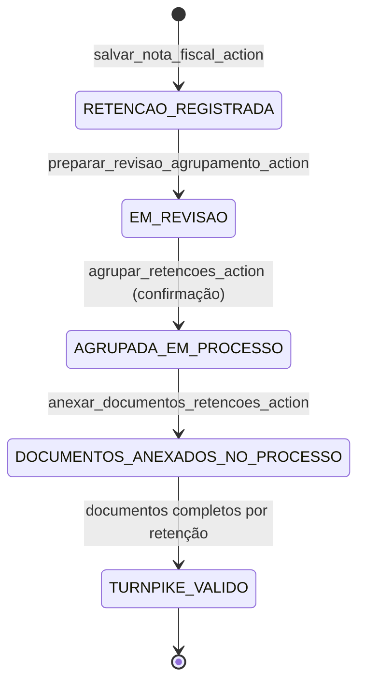

# Fluxo: Retenções de Impostos

Este documento descreve o fluxo canônico de [retenções de impostos](/negocio/glossario_conselho.md#retencao-de-imposto) no PaGé: criação dentro da gestão de [nota fiscal](/negocio/glossario_conselho.md#nota-fiscal), revisão e agrupamento confirmado para recolhimento, e validações de [turnpike](/negocio/glossario_conselho.md#turnpike) no avanço da esteira de pagamento.

---

## Diagrama de workflow (visão macro)



---

## 1. Origem da retenção (spoke fiscal do processo)

**Entradas principais**

- `api_toggle_documento_fiscal` — marca um documento do processo como fiscal, criando `DocumentoFiscal`.
- `api_salvar_nota_fiscal` / `salvar_nota_fiscal_action` — persiste dados da nota e chama `_salvar_retencoes`.

**Fluxo:**

1. No hub do processo (`editar_processo`), o operador acessa a spoke **Liquidações e retenções** (`documentos_fiscais`).
2. Um documento é marcado como fiscal, criando a entrada `DocumentoFiscal`.
3. A nota fiscal é salva via JSON; `_salvar_retencoes` persiste as linhas de imposto vinculadas.

**Regras de `_salvar_retencoes`:**

- Atualiza retenções existentes **in-place** (ordenadas por `id`).
- Cria novas linhas quando o payload contém mais itens que os já persistidos.
- Remove linhas excedentes quando o payload diminui.
- Define `status = "A RETER"` **somente na criação**; atualizações preservam o status vigente.
- Recalcula `nota.valor_liquido` e sincroniza totais do processo fiscal.

!!! warning "Domain seal de pós-pagamento"
    `_status_bloqueia_gestao_fiscal` bloqueia mutações fiscais quando o processo já está em estágios pós-pagamento (`PAGO - EM CONFERÊNCIA` em diante), exceto em [contingência](/negocio/glossario_conselho.md#contingencia) ativa.

---

## 2. Painel de retenções (hub operacional fiscal)

**View:** `painel_impostos_view` — GET `retencao-impostos/`  
**Permissão:** `fiscal.acesso_backoffice`

Três visões selecionáveis via `?visao=`:

| Visão | Dataset principal | Filterset |
|-------|------------------|-----------|
| `individual` (padrão) | `RetencaoImposto` | `RetencaoIndividualFilter` |
| `nf` | `DocumentoFiscal` | `RetencaoNotaFilter` |
| `processo` | `Processo` | `RetencaoProcessoFilter` |

Na visão `individual` o painel resolve e anota em cada objeto:

- **`fonte_retentora_nome`** — beneficiário direto ou, se ausente, emitente da NF; fallback `"NOME NAO INFORMADO"`.
- **`documentacao_completa`** — `True` se existe `DocumentoPagamentoImposto` com `relatorio_retencoes`, `guia_recolhimento` e `comprovante_pagamento` todos preenchidos.

O agrupamento é iniciado a partir desta visão: o operador marca checkboxes e clica em **"Agrupar Selecionados para Guia"**, que envia os IDs para `preparar_revisao_agrupamento_action`.

---

## 3. Revisão antes do agrupamento

O fluxo de agrupamento é composto por duas etapas consecutivas para garantir que o operador revise o que será criado antes de gerar o processo.

### 3.1 Etapa 1 — Preparar revisão (POST)

**Action:** `preparar_revisao_agrupamento_action`  
**URL:** `POST impostos/preparar-revisao/`  
**Permissão:** `fiscal.acesso_backoffice`

Recebe os `retencao_ids` do formulário do painel. Valida que ao menos um ID foi enviado e redireciona para a página de revisão com os IDs como query param:

```
GET /impostos/revisar-agrupamento/?ids=1,2,3
```

!!! note "Transferência de estado stateless"
    Os IDs trafegam via query param no GET de revisão e via `<input type="hidden" name="retencao_ids">` no POST de confirmação. Nenhuma sessão de servidor é utilizada.

### 3.2 Etapa 2 — Página de revisão (GET)

**View:** `revisar_agrupamento_retencoes_view`  
**URL:** `GET impostos/revisar-agrupamento/?ids=1,2,3`  
**Template:** `fiscal/revisar_agrupamento_retencoes.html`  
**Permissão:** `fiscal.acesso_backoffice`

A view:

1. Valida e parseia os IDs da query string.
2. Filtra apenas retenções **elegíveis** (`processo_pagamento__isnull=True`).
3. Avisa se algum ID da seleção original já estava agrupado ou não existe.
4. Redireciona de volta ao painel se nenhuma retenção elegível for encontrada.
5. Calcula e passa ao template:
   - `qtd` — quantidade de retenções elegíveis;
   - `total_base` — soma de `rendimento_tributavel`;
   - `total_valor` — soma de `valor` (total a recolher).

O template exibe:

- Três cards totalizadores (Qtd. Retenções / Base de Cálculo Total / Total a Recolher).
- Tabela detalhada com competência, credor/fonte retentora, NF, código de receita, base de cálculo e valor retido — com linha de rodapé totalizadora.
- Barra de ação fixa no rodapé com botões **"Voltar e reeditar seleção"** e **"Confirmar e Gerar Processo de Recolhimento"**.

---

## 4. Confirmação e criação do processo de recolhimento

**Action:** `agrupar_retencoes_action`  
**URL:** `POST impostos/agrupar/`  
**Permissão:** `fiscal.acesso_backoffice`

Executado somente após confirmação explícita na página de revisão.

Dentro de `transaction.atomic()` com `select_for_update`:

1. Filtra novamente as retenções elegíveis (`processo_pagamento__isnull=True`), garantindo idempotência.
2. Valida que a soma dos valores é positiva.
3. Cria o `Processo` de recolhimento com:
   - credor: `"Órgão Arrecadador (A Definir)"` (get_or_create);
   - tipo de pagamento: `"IMPOSTOS"` (get_or_create);
   - status inicial: `"A PAGAR - PENDENTE AUTORIZAÇÃO"` (get_or_create);
   - `valor_bruto` e `valor_liquido` = soma das retenções.
4. Vincula cada retenção ao processo criado (`retencao.processo_pagamento = novo_processo`).
5. Chama `anexar_relatorio_agrupamento_retencoes_no_processo`.

Redireciona para `editar_processo` do processo criado.

### Relatório PDF de agrupamento

`anexar_relatorio_agrupamento_retencoes_no_processo` (em `fiscal/services/impostos.py`):

- Gera PDF via ReportLab com todos os campos canônicos de cada retenção.
- Empurra todos os documentos existentes do processo uma posição (`ordem += 1`).
- Cria `DocumentoProcesso` com `ordem=1` e tipo `"RELATÓRIO DE RETENÇÕES AGRUPADAS"`.

!!! info "Documento na ordem 1"
    O relatório de agrupamento sempre ocupa a primeira posição (`ordem=1`) nos documentos do processo, garantindo visibilidade imediata no hub.

---

## 5. Anexação mensal de documentos no processo agrupado

**Action:** `anexar_documentos_retencoes_action`  
**URL:** `POST impostos/anexar-documentos/`  
**Permissão:** `fiscal.acesso_backoffice`

**Entradas obrigatórias:**

| Campo | Tipo | Descrição |
|-------|------|-----------|
| `retencao_ids` | lista de IDs | Retenções já agrupadas na competência informada |
| `guia_arquivo` | arquivo | Guia de recolhimento (DARF etc.) |
| `comprovante_arquivo` | arquivo | Comprovante de pagamento |
| `mes_referencia` | inteiro 1–12 | Mês da competência |
| `ano_referencia` | inteiro | Ano da competência |

**Execução** (dentro de `transaction.atomic()`):

1. Filtra retenções da competência informada que já estão agrupadas em processo.
2. Para cada processo de recolhimento envolvido, chama `anexar_guia_comprovante_relatorio_em_processos`.
3. O serviço gera relatório mensal CSV consolidado (agrupado por código de receita + linhas de detalhe) e cria três `DocumentoProcesso`:

| Ordem | Tipo de documento | Conteúdo |
|-------|-------------------|----------|
| 97 | `GUIA DE RECOLHIMENTO DE IMPOSTOS` | arquivo enviado pelo operador |
| 98 | `COMPROVANTE DE RECOLHIMENTO DE IMPOSTOS` | arquivo enviado pelo operador |
| 99 | `RELATÓRIO MENSAL DE RETENÇÕES` | CSV gerado automaticamente (UTF-8 BOM) |

---

## 6. Turnpike para avanço em comprovantes

Na transição `LANÇADO - AGUARDANDO COMPROVANTE` → `PAGO - EM CONFERÊNCIA`, o validador `verificar_turnpike` (em `pagamentos/validators.py`) aplica regra adicional para processos do tipo IMPOSTOS:

1. Chama `validar_completude_recolhimento_impostos`.
2. Que chama `verificar_completude_documentos_impostos` (em `fiscal/services/impostos.py`).
3. Bloqueia a transição se qualquer retenção vinculada ao processo não possuir `DocumentoPagamentoImposto` com os três arquivos preenchidos (`relatorio_retencoes`, `guia_recolhimento`, `comprovante_pagamento`).

---

## Referências de código

| Componente | Localização |
|-----------|------------|
| Registro de nota fiscal e retenções | `pagamentos/views/pre_payment/cadastro/actions.py` |
| Turnpikes de transição de status | `pagamentos/validators.py` |
| Painel e página de revisão (GET) | `fiscal/views/impostos/panels.py` |
| Actions de seleção, agrupamento e anexação (POST) | `fiscal/views/impostos/actions.py` |
| Serviços: PDF, CSV, anexação | `fiscal/services/impostos.py` |
| Modelos fiscais | `fiscal/models.py` |
| URLs fiscais | `DjangoProject/urlconf/fiscal.py` |
