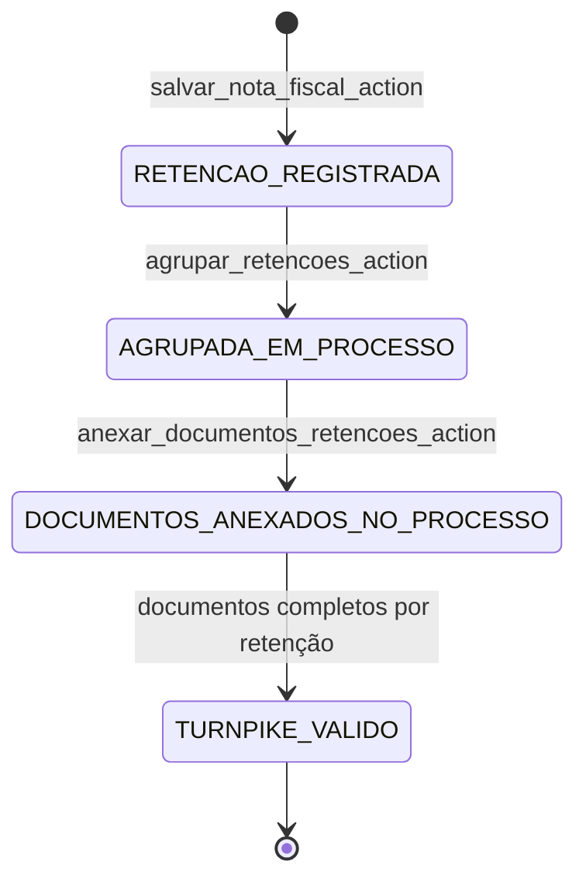

# Fluxo: Retenções de Impostos

Este documento descreve o fluxo canônico de retenções no PaGé: criação dentro da gestão de nota fiscal, agrupamento para recolhimento e validações de turnpike no avanço da esteira de pagamento.

---

## Diagrama de workflow (visão macro)

---

## 1. Origem da retenção (spoke fiscal do processo)

**Entradas principais**
- `api_toggle_documento_fiscal` / `toggle_documento_fiscal_action`
- `api_salvar_nota_fiscal` / `salvar_nota_fiscal_action`

Fluxo:
1. No hub do processo, o operador entra na spoke **Liquidações e retenções** (`documentos_fiscais`).
2. Um documento do processo é marcado como fiscal, criando `DocumentoFiscal`.
3. A nota fiscal é salva via JSON e `_salvar_retencoes` persiste as linhas de imposto.

Regras de `_salvar_retencoes`:
- atualiza retenções existentes **in-place** (ordem por `id`);
- cria novas linhas quando o payload tem mais itens;
- remove linhas excedentes quando o payload diminui;
- define status `"A RETER"` **apenas na criação**;
- recalcula `nota.valor_liquido` e sincroniza totais do processo fiscal.

!!! warning "Domain seal de pós-pagamento"
    `_status_bloqueia_gestao_fiscal` bloqueia mutações fiscais quando o processo já está em estágios pós-pagamento (`PAGO - EM CONFERÊNCIA` em diante), exceto em contingência ativa.

---

## 2. Painel de retenções (hub operacional fiscal)

**View:** `painel_impostos_view`  
**Permissão:** `fiscal.acesso_backoffice`

Visões disponíveis por `?visao=`:

| Visão | Dataset | Filtro |
|-------|---------|--------|
| `individual` | `RetencaoImposto` | `RetencaoIndividualFilter` |
| `nf` | `DocumentoFiscal` | `RetencaoNotaFilter` |
| `processo` | `Processo` | `RetencaoProcessoFilter` |

Na visão `individual`, o painel calcula:
- **fonte retentora** (beneficiário ou emitente da NF);
- **documentação completa** por retenção, com base em `DocumentoPagamentoImposto` contendo relatório + guia + comprovante.

---

## 3. Agrupamento para processo de recolhimento

**Action:** `agrupar_retencoes_action` (POST)

Regras:
1. Seleciona apenas retenções com `processo_pagamento` nulo.
2. Cria processo de recolhimento com:
   - credor `"Órgão Arrecadador (A Definir)"`,
   - tipo de pagamento `"IMPOSTOS"`,
   - status inicial `"A PAGAR - PENDENTE AUTORIZAÇÃO"`,
   - valor bruto/líquido = soma das retenções selecionadas.
3. Vincula cada retenção ao novo processo (`retencao.processo_pagamento`).
4. Anexa relatório PDF de agrupamento no processo (`anexar_relatorio_agrupamento_retencoes_no_processo`).

---

## 4. Anexação mensal de documentos no processo agrupado

**Action:** `anexar_documentos_retencoes_action` (POST)

Entrada obrigatória:
- retenções selecionadas (`retencao_ids`);
- `guia_arquivo` e `comprovante_arquivo`;
- competência (`mes_referencia`, `ano_referencia`).

Execução:
1. Filtra retenções da competência informada e já agrupadas.
2. Para cada processo de recolhimento envolvido, chama `anexar_guia_comprovante_relatorio_em_processos`.
3. O serviço gera relatório mensal CSV consolidado e cria 3 `DocumentoProcesso` por processo:
   - ordem 97: guia;
   - ordem 98: comprovante;
   - ordem 99: relatório mensal.

---

## 5. Turnpike para avanço em comprovantes

No avanço `LANÇADO - AGUARDANDO COMPROVANTE` → `PAGO - EM CONFERÊNCIA`, o turnpike de `pagamentos.validators.verificar_turnpike` aplica validação adicional para processos do tipo IMPOSTOS:

- chama `validar_completude_recolhimento_impostos`;
- que chama `verificar_completude_documentos_impostos`;
- e bloqueia a transição se existir retenção sem `DocumentoPagamentoImposto` completo.

---

## Referências de código

| Componente | Localização |
|-----------|------------|
| Gestão fiscal da nota e retenções | `pagamentos/views/pre_payment/cadastro/actions.py` |
| Turnpikes de transição | `pagamentos/validators.py` |
| Painel de retenções (GET) | `fiscal/views/impostos/panels.py` |
| Ações de agrupamento/anexação (POST) | `fiscal/views/impostos/actions.py` |
| Serviços de anexação/relatórios | `fiscal/services/impostos.py` |
| Modelos fiscais | `fiscal/models.py` |
