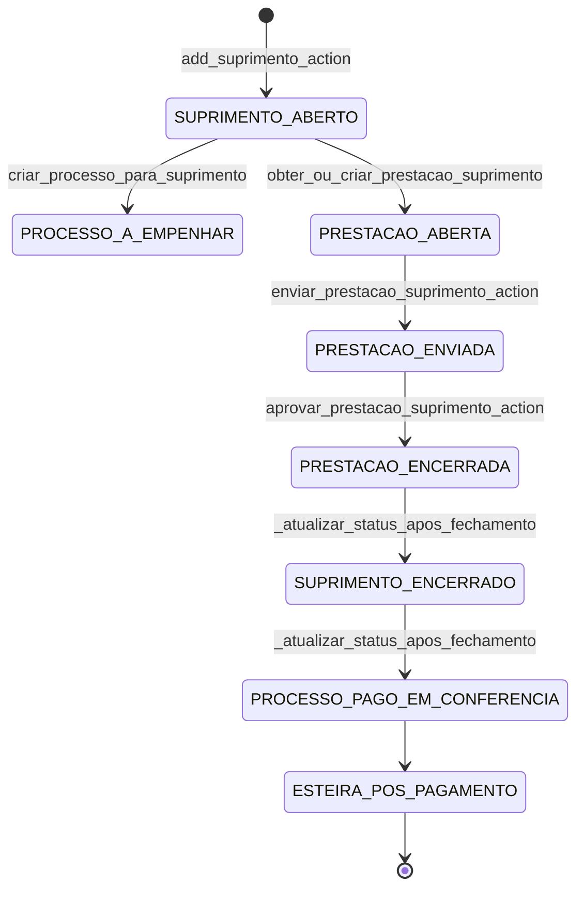

# Fluxo: Suprimento de Fundos

Este documento descreve o workflow operacional vigente de suprimentos, incluindo a nova etapa formal de prestação de contas (`ABERTA → ENVIADA → ENCERRADA`) e a integração com o `Processo`.

---

## Diagrama de workflow (macro)

---

## 1. Entidades e estados

### `SuprimentoDeFundos`

- Estado inicial: `ABERTO`.
- Estado final: `ENCERRADO`.
- Mantém vínculo com `Processo` financeiro criado automaticamente.

### `PrestacaoContasSuprimento`

- Relacionamento `OneToOne` com `SuprimentoDeFundos`.
- Estados:
  - `ABERTA` (edição/liberação para envio),
  - `ENVIADA` (fila de revisão operacional),
  - `ENCERRADA` (aprovada/fechada).

### Selagem de domínio (immutability gate)

Quando o `Processo` vinculado está em estágios pagos ou posteriores, mutações sensíveis de `SuprimentoDeFundos` e `DespesaSuprimento` são bloqueadas (`save/delete` e operações em massa).

---

## 2. Concessão do suprimento

**GET:** `add_suprimento_view`  
**POST:** `add_suprimento_action`  
**Permissão:** `suprimentos.acesso_backoffice`

Na criação:

1. O suprimento nasce como `ABERTO`.
2. É criado um `Processo` com:
   - tipo: `SUPRIMENTO DE FUNDOS`,
   - status inicial: `A EMPENHAR`,
   - `valor_bruto = valor_liquido + taxa_saque`.
3. O `Processo` é vinculado ao suprimento.

---

## 3. Execução e lançamento de despesas

**Hub:** `gerenciar_suprimento_view` (somente leitura com comandos)  
**Spoke de inclusão:** `adicionar_despesa_view` / `adicionar_despesa_action`

Regras operacionais:

- Inclusão de despesas só ocorre enquanto:
  - suprimento não estiver encerrado, e
  - prestação estiver `ABERTA`.
- Cada despesa registra dados fiscais/financeiros e arquivo comprobatório.

---

## 4. Envio da prestação (suprido)

**POST:** `enviar_prestacao_suprimento_action`  
**Service:** `enviar_prestacao_suprimento`

Transição: `ABERTA → ENVIADA`.

Validações:

- Se `saldo_remanescente > 0`, comprovante de devolução é obrigatório.
- Exige confirmação do termo de fidedignidade no formulário.

Efeitos:

- marca `submetido_em`, `submetido_por`,
- grava comprovante/data de devolução (quando informados),
- envia para fila de revisão operacional.

---

## 5. Revisão e aprovação (operador)

**Fila:** `revisar_prestacoes_suprimento_view`  
**Tela de revisão:** `revisar_prestacao_suprimento_view`  
**POST de aprovação:** `aprovar_prestacao_suprimento_action`  
**Service:** `encerrar_prestacao_suprimento`

Transição: `ENVIADA → ENCERRADA`.

Na aprovação:

1. Se houver saldo remanescente, cria `Devolucao` automaticamente no `Processo` com base no comprovante da prestação.
2. Executa `_atualizar_status_apos_fechamento`:
   - `Processo` vai para `PAGO - EM CONFERÊNCIA`;
   - `SuprimentoDeFundos` vai para `ENCERRADO`.
3. Fecha a prestação (`encerrado_em`, `encerrado_por`).

---

## 6. Cancelamento

**Spoke (GET):** `cancelar_suprimento_spoke_view`  
**Action (POST):** `cancelar_suprimento_action`  
**Permissão:** `suprimentos.acesso_backoffice`  
**Serviço:** `cancelar_suprimento` (`pagamentos/services/cancelamentos.py`)

- Justificativa é sempre obrigatória.
- **Quando o suprimento está com `status_choice == "ENCERRADO"`**, o formulário exige os dados de devolução correspondente (valor, data e comprovante). A `DevolucaoProcessual` é criada atomicamente na mesma transação.
- A transação atômica:
  1. Cria `DevolucaoProcessual` no processo vinculado (se encerrado).
  2. Define status do processo como `CANCELADO / ANULADO`.
  3. Define status do suprimento como `CANCELADO / ANULADO`.
  4. Grava `CancelamentoProcessual` (tipo `SUPRIMENTO`).

Consulte o [Fluxo de Cancelamento](cancelamento.md) para a especificação completa.

---

## 7. Ação legada de fechamento direto

Existe rota de fechamento direto (`fechar_suprimento_action`) que também chama `_atualizar_status_apos_fechamento`.  
No fluxo operacional recomendado, o fechamento deve ocorrer pela trilha formal de prestação (`ENVIADA` + aprovação).

---

## 8. Referências de código

| Componente | Localização |
|-----------|------------|
| Modelos de suprimento/prestação | `suprimentos/models.py` |
| Cadastro (GET/POST) | `suprimentos/views/cadastro/panels.py` / `suprimentos/views/cadastro/actions.py` |
| Painéis de prestação (GET) | `suprimentos/views/prestacao_contas/panels.py` |
| Ações de prestação (POST) | `suprimentos/views/prestacao_contas/actions.py` |
| Serviços de prestação | `suprimentos/services/prestacao.py` |
| Atualização de status após fechamento | `suprimentos/views/helpers.py` |
| Integração com processo | `suprimentos/services/processo_integration.py` |
| **Serviço de cancelamento** | **`pagamentos/services/cancelamentos.py`** |
